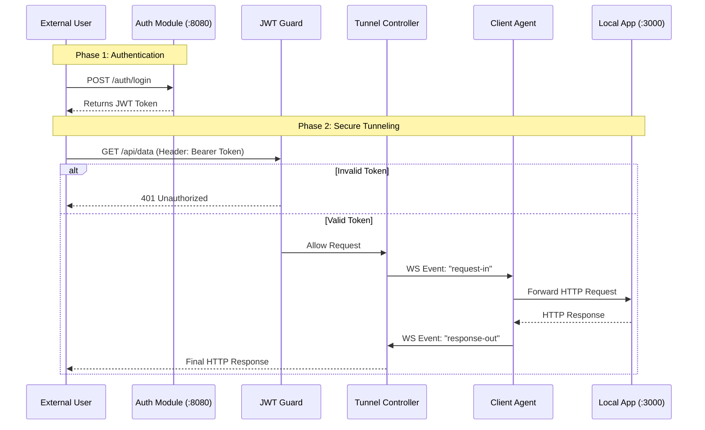

# Secure Reverse HTTP Tunneling System

A distributed reverse proxy system that exposes locally running services (behind NATs/Firewalls) to the public internet via a secure WebSocket tunnel. Built with NestJS (Server), MongoDB (Auth), and Node.js (Client).

## Prerequisites

- **Node.js** (v16+)
- **MongoDB** (Must be running locally on default port `27017`)

---

## Quick Start

You will need 3 separate terminal windows.

### 1. Start the Tunnel Server

This is the public-facing entry point. It now connects to MongoDB for user authentication.

```bash
cd tunnel-server
npm install
npm run start
# Server starts on http://localhost:8080
# Connected to MongoDB at mongodb://localhost:27017/tunnel-db
```

### 2. Start a Local Application

If you don't have a local app running, use the included dummy server.

```bash
# In Terminal 2
node dummy-local-app.js
# Dummy App listens on http://localhost:3000
```

### 3. Start the Client Agent

This connects your local app to the public server.

```bash
cd client-agent
npm install
node client.js
# Logs: "Connected to Tunnel Server!"
```

---

## Authentication & Usage Flow

The system now enforces **JWT Authentication** for all external traffic. You cannot access the tunnel without a valid token.

### Step 1: Register a User

Create a new account to generate your credentials.

```bash
curl -X POST http://localhost:8080/auth/register \
     -H "Content-Type: application/json" \
     -d '{"username": "admin", "password": "password123"}'
```

### Step 2: Login to Get Token

Exchange your credentials for a secure access token.

```bash
curl -X POST http://localhost:8080/auth/login \
     -H "Content-Type: application/json" \
     -d '{"username": "admin", "password": "password123"}'
```

**Response:**

```json
{
  "access_token": "eyJhbGciOiJIUzI1Ni..."
}
```

> Copy this token for the next step.

### Step 3: Access the Tunnel

Make requests to your local app through the tunnel using the token. Note that all tunnel traffic is now under the `/api` prefix.

```bash
# Replace <YOUR_TOKEN> with the actual token string
curl -H "Authorization: Bearer <YOUR_TOKEN>" \
     -H "x-agent-id: laptop-1" \
     http://localhost:8080/api/status
```

**Expected Output:**

```json
{
  "message": "Hello from the hidden local app!",
  "timestamp": "..."
}
```

---

## System Architecture

The system implements a **Secure Multiplexed WebSocket Tunnel**.

- **Auth Guard:** Intercepts incoming HTTP requests. Validates the JWT against the secret.
- **Tunnel Controller:** If authorized, pauses the request and forwards it to the Gateway.
- **Gateway:** Routes the payload to the correct Agent via WebSocket.

### Secure Request Flow



---

## Project Structure

```
🏠
├── dummy-local-app.js      # Simple HTTP server for testing
│
├── /tunnel-server          # [NestJS] The Public Server
│   ├── src/
│   │   ├── auth/           # [NEW] Authentication Logic
│   │   │   ├── auth.controller.js  # Login/Register endpoints
│   │   │   ├── auth.service.js     # Auth business logic
│   │   │   ├── auth.module.js      # Module configuration
│   │   │   └── jwt.strategy.js     # Token verification
│   │   ├── users/          # [NEW] User Database Logic
│   │   │   ├── users.service.js    # CRUD operations
│   │   │   ├── users.module.js     # Module configuration
│   │   │   └── schemas/
│   │   │       └── user.schema.js  # Mongoose schema
│   │   ├── tunnel.gateway.js     # WebSocket Logic
│   │   ├── tunnel.controller.js  # Secured HTTP Ingress
│   │   ├── app.module.js         # Root module
│   │   └── main.js               # Application entry point
│   └── package.json
│
└── /client-agent           # [Node.js] The Local Proxy
    ├── client.js           # Main logic (Socket.io Client + Axios)
    └── config.json         # Agent configuration
```

---

## Configuration

### Tunnel Server

| Setting  | Value                                    |
| -------- | ---------------------------------------- |
| Port     | `8080` (Configurable in `main.js`)       |
| Database | `mongodb://localhost:27017/tunnel-db`    |
| JWT Secret | Defined in `jwt.strategy.js`           |

### Client Agent

Configured in `client-agent/config.json`:

| Key          | Description                              |
| ------------ | ---------------------------------------- |
| `serverUrl`  | `http://localhost:8080`                  |
| `localAppUrl`| `http://localhost:3000`                  |
| `agents`     | List of agent profiles (`clientId`, `token`) |

---

## Design Decisions

### 1. MongoDB & JWT for Security

We moved from an open system to a secured architecture. MongoDB stores hashed credentials (using bcrypt), while JWTs provide **stateless authentication**, allowing the tunnel to scale without constant database lookups for every packet.

### 2. Separating Auth from Tunneling

The `AuthModule` is completely decoupled from the `TunnelGateway`. This **separation of concerns** means we can swap the authentication provider (e.g., to OAuth or API Keys) without breaking the tunneling logic.

### 3. Route Separation (`/auth` vs `/api`)

- `/auth/*` routes are **public** (no JWT required) for registration and login.
- `/api/*` routes are **protected** and require a valid JWT token.

This prevents the wildcard tunnel controller from intercepting authentication requests.

---

## API Reference

### Authentication Endpoints

| Method | Endpoint         | Description          | Auth Required |
| ------ | ---------------- | -------------------- | ------------- |
| POST   | `/auth/register` | Create new user      | No            |
| POST   | `/auth/login`    | Get JWT token        | No            |

### Tunnel Endpoints

| Method | Endpoint   | Description                    | Auth Required |
| ------ | ---------- | ------------------------------ | ------------- |
| ALL    | `/api/*`   | Forward to agent via tunnel    | Yes (JWT)     |

---

## Troubleshooting

### 401 Unauthorized on `/auth/register`

**Cause:** The wildcard controller is intercepting auth routes.

**Solution:** Ensure `TunnelController` uses `@Controller('api')` prefix, not `@Controller()`.

### Agent Not Connected

**Cause:** The client agent failed to authenticate with the WebSocket gateway.

**Solution:** Check that the `token` in `config.json` matches one of the valid tokens in `tunnel.gateway.js`.

### MongoDB Connection Error

**Cause:** MongoDB is not running.

**Solution:** Start MongoDB with `mongod` or `brew services start mongodb-community`.