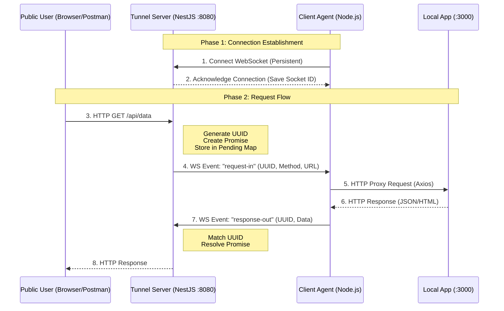

# Reverse HTTP Tunneling System

A distributed reverse proxy system that exposes locally running services (behind NATs/Firewalls) to the public internet via a secure WebSocket tunnel. Built with NestJS (Server) and Node.js (Client).

## Quick Start

This project requires Node.js (v16+) and npm. The system consists of three parts. You will need 3 separate terminal windows.

### 1. Start the Tunnel Server

This is the public-facing entry point that accepts HTTP requests and routes them to agents.

```bash
cd tunnel-server
npm install
npm run start
# Server will start on http://localhost:8080
```

### 2. Start a Local Application

If you don't have a local app running, use the included dummy server.

```bash
# In a new terminal
node dummy-local-app.js
# Dummy App will listen on http://localhost:3000
```

### 3. Start the Client Agent

This connects your local app to the public server.

```bash
cd client-agent
npm install
node client.js
# Should log: "Connected to Tunnel Server!"
```

## How to Test

Since this system supports Multiple Clients, you must specify which agent you want to talk to using the `x-agent-id` header.

### 1. Basic Health Check

Run this curl command to forward a request from port 8080 -> Agent -> 3000.

```bash
curl -H "x-agent-id: laptop-1" http://localhost:8080/api/status
```

Expected Output:

```json
{
  "message": "Hello from the hidden local app!",
  "timestamp": "2023-10-27T10:00:00.000Z"
}
```

### 2. Test Data Submission (POST)

```bash
curl -X POST http://localhost:8080/users \
     -H "x-agent-id: laptop-1" \
     -H "Content-Type: application/json" \
     -d '{"name": "Alice"}'
```

### 3. Test Routing (Fail Case)

Try accessing a non-existent agent:

```bash
curl -H "x-agent-id: laptop-99" http://localhost:8080/
# Output: 404 Agent 'laptop-99' is not connected
```

## System Architecture

The system implements a Multiplexed WebSocket Tunnel.

- **Tunnel Server (NestJS):** Acts as the ingress. It does not know how to handle business logic. It simply holds the HTTP request open ("pending state").
- **Client Agent (Node.js):** Initiates an outbound WebSocket connection to the server. This bypasses firewalls because it is an outbound TCP connection.

### The Handshake

When the Client connects, it authenticates with a token and registers its `agentId`.

### The Flow

1.  User hits Server with `x-agent-id: laptop-1`.
2.  Server looks up the socket ID for `laptop-1`.
3.  Server emits `request-in` event to that socket.
4.  Client receives event, fires axios request to `localhost:3000`.
5.  Client emits `response-out` back to server.
6.  Server resolves the pending HTTP request.



## Project Structure

```
🏠
├── dummy-local-app.js     # Simple HTTP server for testing
│
├── /tunnel-server         # [NestJS] The Public Server
│   ├── src/
│   │   ├── tunnel.gateway.js    # WebSocket Logic (Auth, Routing, Registry)
│   │   ├── tunnel.controller.js # HTTP Ingress (Request Pausing)
│   │   └── ...
│   └── package.json
│
└── /client-agent          # [Node.js] The Local Proxy
    ├── client.js          # Main logic (Socket.io Client + Axios)
    └── package.json
```

## Configuration

### Tunnel Server

Currently configured via hardcoded values in `tunnel.gateway.js` for simplicity.

- Port: 8080
- Auth Token: `secret-password-123`

### Client Agent

Configured in `client-agent/config.json`.

- **serverUrl**: The public tunnel server URL (e.g., `http://localhost:8080`).
- **localAppUrl**: The local service you want to expose (e.g., `http://localhost:3000`).
- **agents**: An array of agent profiles. Each agent creates a separate connection.
  - `clientId`: Unique identifier for the agent (used in `x-agent-id` header).
  - `token`: Authentication token for the agent.

## Design Decisions

### 1. Why Plain Node.js for the Client?

The Client Agent is designed to be lightweight and portable. A raw Node.js script has zero boilerplate and can be easily bundled into a binary (using pkg) or run in low-resource environments (containers, IoT devices) without the overhead of a full framework.

### 2. Why WebSockets over TCP?

While raw TCP offers slightly better performance, WebSockets provide:

- **Message Framing:** We don't have to parse raw byte streams to find where one JSON object ends.
- **Firewall Traversal:** WebSockets run over port 80/443, which are open on almost all corporate networks.

## Implemented Features

- **NestJS Implementation:** The Tunnel Server is built entirely in NestJS.
- **Multiple Clients:** The server maintains a registry of agents and routes traffic based on the `x-agent-id` header.
- **Authentication:** Agents must provide a valid token during the connection handshake.
